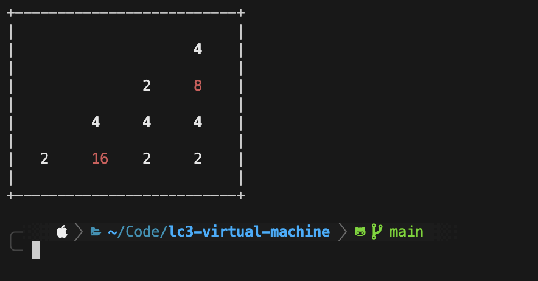
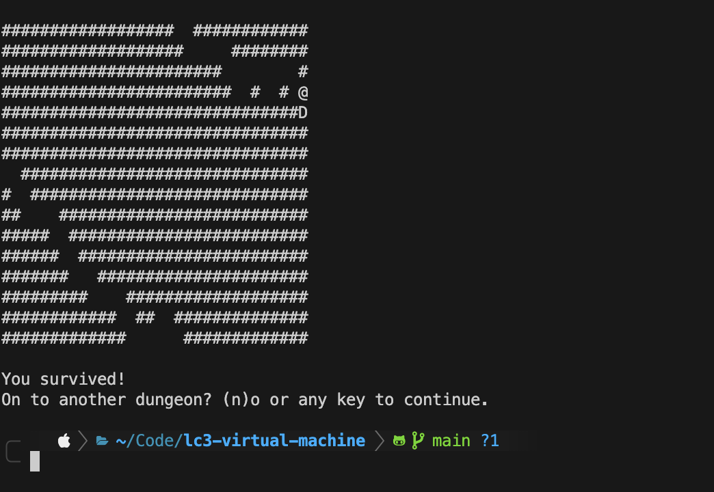
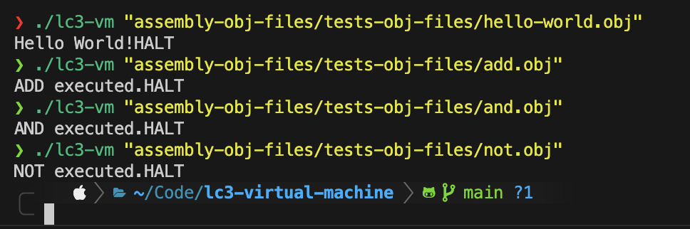

# LC-3 Virtual Machine


An implementation of an **LC-3 Virtual Machine** capable of executing programs written in **LC-3 assembly language**.

This project implements the **LC-3 instruction set architecture (ISA)** directly, including opcode decoding, register operations, memory handling, trap routines, and keyboard input.  
The VM loads **LC-3 object files (`.obj`)** and executes them using the standard **fetch → decode → execute** cycle.

Working on this project provided hands-on understanding of:

- instruction decoding and execution
- register and memory interaction
- program execution flow
- terminal-based input/output
- keyboard interaction through memory-mapped I/O

---

# Key Files

### `lc3-vm.c`

The **main implementation** of the LC-3 Virtual Machine.

It contains the processor simulation including:

- instruction decoding  
- register operations  
- memory handling  
- trap routines  
- keyboard input handling  
- execution loop  

---

### `lc3-vm-annotated.c`

A **fully annotated version** of the virtual machine implementation.

Every important section of the architecture is clearly explained, including:

- instruction decoding
- trap routines
- register operations
- memory access
- execution flow

This file is intended for anyone who wants to understand **how the LC-3 architecture works internally**.

It can also be compiled and executed just like the main implementation.

---

# LC-3 File Types

### `.asm`

Human-readable LC-3 assembly source code.

### `.obj`

Binary machine code generated after assembling an `.asm` program.  
These files are executed by the virtual machine.

### `.sym`

Symbol file generated during assembly containing symbol table information.

---

# Prebuilt Object Programs

The repository already includes several **prebuilt `.obj` files**, so you can run programs immediately without assembling anything.

They are located in the **`assembly-obj-files`** directory.

```
assembly-obj-files/
├── 2048.obj
├── rogue.obj
└── test-obj-files/
    ├── add.obj
    ├── and.obj
    ├── not.obj
    └── hello-world.obj
```

- `2048.obj` and `rogue.obj` are **playable terminal programs**.
- `test-obj-files` contains **simple programs** useful for understanding how basic LC-3 instructions work.

If you only want to try the virtual machine, you can **skip the assembly step entirely** and continue directly to **[Running a Program](#running-program)**.

Make sure the VM is compiled first. The compiled executable (generated during the **Compiling the Virtual Machine** step below) is used to run the object programs.

---

# Compiling the Virtual Machine

Compile using GCC:

```
gcc lc3-vm.c -o lc3-vm
```

Or compile the annotated version:

```
gcc lc3-vm-annotated.c -o lc3-vm
```

The executable name can be changed if desired.

Example:

```
gcc lc3-vm.c -o vm
```

---

# Assembling Programs (Optional)

Assembly programs (`.asm`) normally need to be converted into object files (`.obj`) before execution.

If you want to assemble programs manually, use the included assembler:

```
./lc3as "add.asm"
```

This generates:

```
add.obj
add.sym
```

If the assembly file is in another directory, provide the correct path.

Example:

```
./lc3as "tests/add/add.asm"
```

After assembling, continue to the **Running a Program** section.

---

<a id="running-program"></a>

# Running a Program

Run an object file using the virtual machine:

```
./lc3-vm "add.obj"
```

Example with a path:

```
./lc3-vm "assembly-obj-files/test-obj-files/add.obj"
```

---

# Playable Programs

The repository includes larger LC-3 programs such as:

```
2048.obj
rogue.obj
```

These run directly inside the terminal.

- Input is handled through **direct keyboard interaction**
- Output follows **ASCII terminal behavior**
- Movement uses **W A S D** keys

These programs demonstrate the VM executing larger interactive LC-3 programs.

---

# LC-3 Assembler (Unix)

A prebuilt **LC-3 assembler (`lc3as`)** is already included for assembling the test programs.

If you want to build the LC-3 tools manually on a **Unix-based system**, the repository also contains:

```
lc3tools-unix
```

Steps:

```
cd lc3tools-unix
./configure
make
```

This will build the LC-3 tools.  
Inside the generated directories you will find the **LC-3 assembler (`lc3as`)** which can be used to assemble `.asm` programs.

---

# Cross Platform Support

The implementation supports:

- **Unix / macOS**
- **Windows**

Platform-specific sections are clearly marked in the source code.  
Switching between implementations only requires commenting or uncommenting the appropriate blocks.

---

# Screenshots

### 2048 Running on the LC-3 Virtual Machine


### Rogue Running on the LC-3 Virtual Machine


### Test Programs Execution

